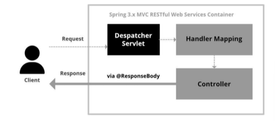
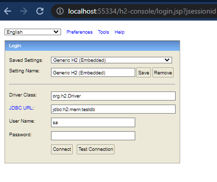

# ☀️ Users 마이크로서비스

| No. | 기능              | URI(API Gateway 사용시)             | URI (API Gateway 미사용) | HTTP Method |
|:----|:----------------|:---------------------------------|:----------------------|:------------:|
| 1   | 사용자 정보 등록       | /user-sevice/users               | /users                | POST        |
| 2   | 전체 사용자 조회       | /user-service/users              | /users                | GET                              |
| 3   | 사용자 정보, 주문내역 조회 | /user-service/users/{user_id}    |/users/{user_id} | GET                              |
| 4   | 작동 상태 확인        | /user-service/users/health-check | /users/health-check   | GET                         |
| 5   | 환영 메세지          | /user-service/users/welcome      | /users/welcome        |GET|

# ⭐ 상태 체크


```java
import org.springframework.web.bind.annotation.GetMapping;
import org.springframework.web.bind.annotation.RequestMapping;
import org.springframework.web.bind.annotation.RestController;

@RestController
@RequestMapping("/")
public class UserController {

    @GetMapping("/health_check")
    public String status() {
        return "It's Working in User Service";
    }
    
}

```



|키워드| 내용                                                 |
|:---|:---------------------------------------------------|
|@RestController| @RestController를 사용하면 @Responsebody를 사용 안해도 리턴 해줌 |


<br/>
<br/>
<br/>

# ⭐ 구성 파일에서 데이터 가져오기

<br/>

#### 📋 application.properties

```properties
greeting.message=Welcome to the Simple E-Commerce
```

<br/>

#### 📋 UserController
```java
import org.springframework.beans.factory.annotation.Autowired;
import org.springframework.core.env.Environment;
import org.springframework.web.bind.annotation.GetMapping;
import org.springframework.web.bind.annotation.RequestMapping;
import org.springframework.web.bind.annotation.RestController;

@RestController
@RequestMapping("/")
public class UserController {

    private Environment env;

    @Autowired
    public UserController(Environment env) {
        this.env = env;
    }

    @GetMapping("/welcome")
    public String welcome() {
        return env.getProperty("greeting.message");
    }

    @GetMapping("/health_check")
    public String status() {
        return "It's Working in User Service";
    }

}
```

<br/>
<br/>
<br/>

# ⭐ h2 데이터베이스 추가

<br/>

#### 📋 application.properties
```properties
spring.h2.console.enabled=true
spring.h2.console.settings.web-allow-others=true
spring.h2.console.path=/h2-console
```

<br/>

#### 📋 build.gradle

```groovy
implementation 'com.h2database:h2'
```


<br/>

#### 📋 결과

